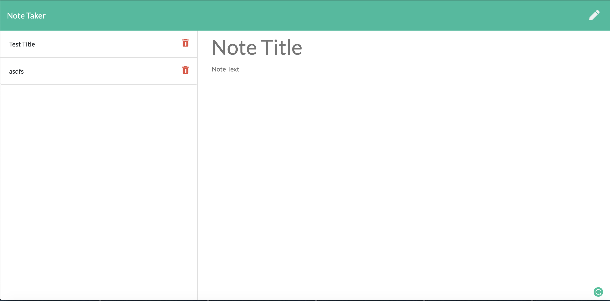
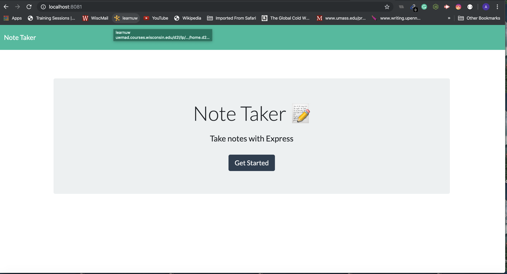

# notetaker

Note Taker - It is an application to write, Save and Delete notes. User can decide what notes to be added or decide to select a record to Delete as well.

Built With
Html - UI features
CSS - Style sheet
Node JS
Express
Javascript

Versioning
Github
Screenshots:

